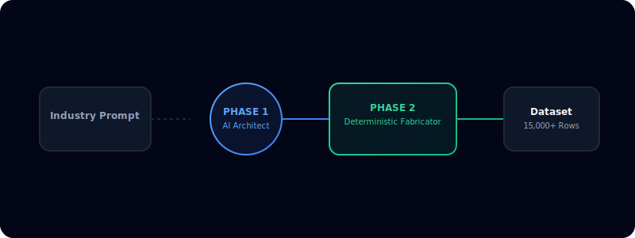
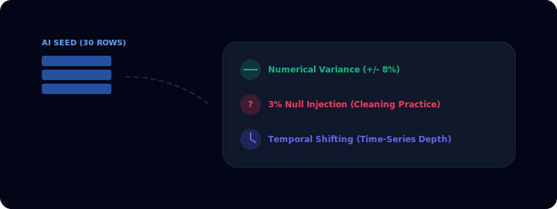

# DataForge: The Data Analyst Flight Simulator

DataForge is a high-fidelity "flight simulator" for aspiring data analysts. It bridges the gap between basic tutorials and complex enterprise environments by forging endless, context-rich analytical missions on demand.

---

## The Core Concept

DataForge operates on the principle that real analysis is messy, relational, and goal-oriented. 
1.  **On-Demand Forging**: Select any industry (e.g., SaaS, Retail, Fintech) and difficulty level.
2.  **Hybrid Data Generation**: A combination of AI logic and deterministic scaling creates 15,000+ rows of realistic data.
3.  **In-Browser IDE**: A full-stack analytical environment with Python (Pandas) and SQL (SQLite) running via WebAssembly.

## The Generation Algorithm: Architect & Fabricator

The realism of DataForge data comes from a sophisticated two-phase pipeline designed to simulate business context while maintaining statistical volume.

### Phase 1: The AI Architect (Contextual Intelligence)
When you trigger a mission, **Gemini 3 Flash** acts as a Senior Data Architect. Instead of generating random numbers, it builds a logical business ecosystem from scratch:
- **Semantic Mapping**: It assigns industry-specific column names and logic (e.g., `subscription_mrr` for SaaS or `dwell_time_minutes` for Logistics).
- **Schema Blueprint**: It designs the relational structure—ranging from a simple Flat File (Beginner) to a complex Star Schema with Fact/Dimension tables (Advanced).
- **The Seed**: It generates 30 "Perfect" rows. This seed establishes the core relational integrity and plants the "Insights" (correlations, trends) you need to discover.

### Phase 2: The Deterministic Fabricator (Scaling & Realism)
Since LLMs cannot efficiently generate 15,000 rows of valid JSON text without hallucinations, a specialized **TypeScript Augmentation Engine** scales the AI seed into a massive dataset.

**How we make the data realistic:**
- **Weighted Cloning**: The engine replicates the AI seed 500x while preserving the statistical distribution of categories.
- **Gaussian-like Variance**: Numerical columns are subjected to a **+/- 8% variance**. A $100.00 transaction in the seed becomes $94.20 or $107.80 in the augmented set, creating realistic distributions.
- **Controlled Entropy (Noise)**: 
  - **Null Injection**: A 3% probability for any cell to be set to `null`, forcing you to practice `COALESCE` or `df.fillna()`.
  - **Outlier Spikes**: Occasional multiplier logic (x1.5 or x0.7) creates outliers for you to identify during EDA.
- **Temporal Shifting**: Dates are shifted across a wide range to provide depth for Time-Series analysis and Month-over-Month (MoM) calculations.

## The Analysis Environment

### Hybrid Logic Notebook
DataForge features a custom notebook interface that supports both **SQL** and **Python** in a unified session.
- **Pyodide**: Runs a full Python 3.x stack (Pandas, Numpy) in your browser.
- **SQL.js**: An SQLite engine for relational query practice.
- **State Sync**: Changes made in Python (e.g., creating a new calculated table) can be synced back to the SQL engine via a custom WASM bridge.

### Socratic Mentor
The "Senior Mentor" is a Gemini-powered tutor programmed with a **No-Spoiler Policy**. It monitors your code and schema to provide conceptual nudges, analogies, and business strategy advice without giving you the code directly.

---

## Tech Stack

- **Framework**: React 19 + TypeScript.
- **AI Core**: `@google/genai` (Gemini 3 Flash).
- **WASM Runtimes**: Pyodide & SQL.js.
- **Editor**: CodeMirror 6 with custom data-symbol autocompletion.

---

*Forge your edge. Master the data.*